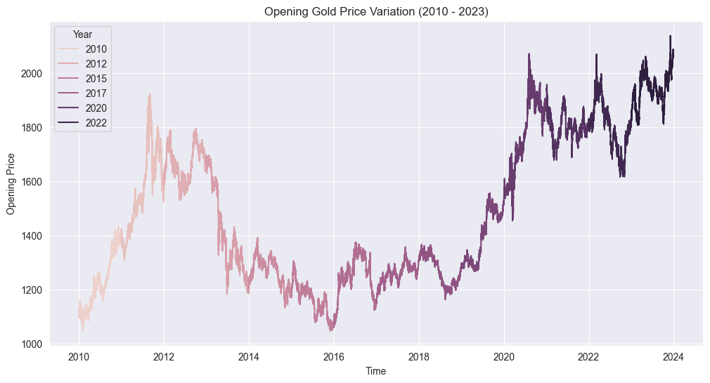
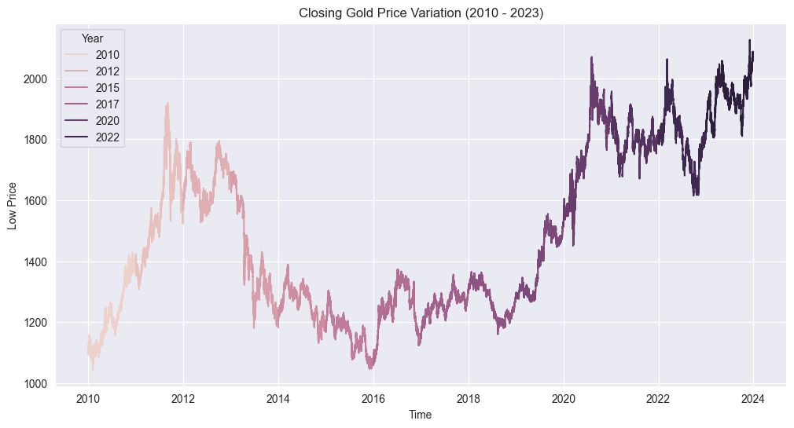
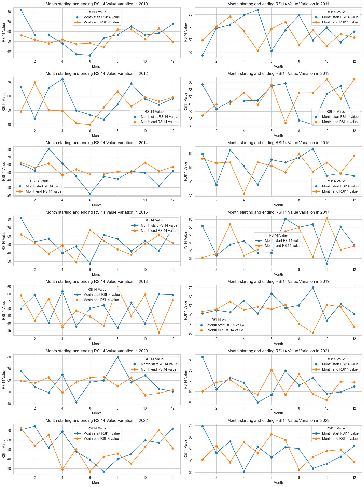
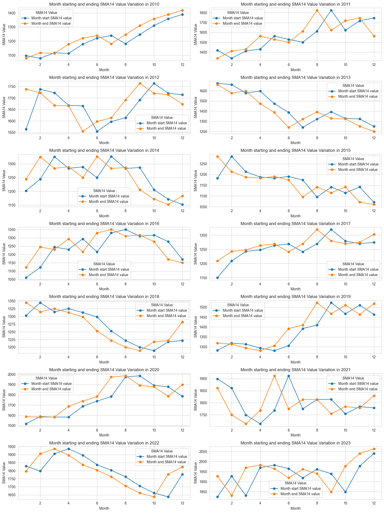
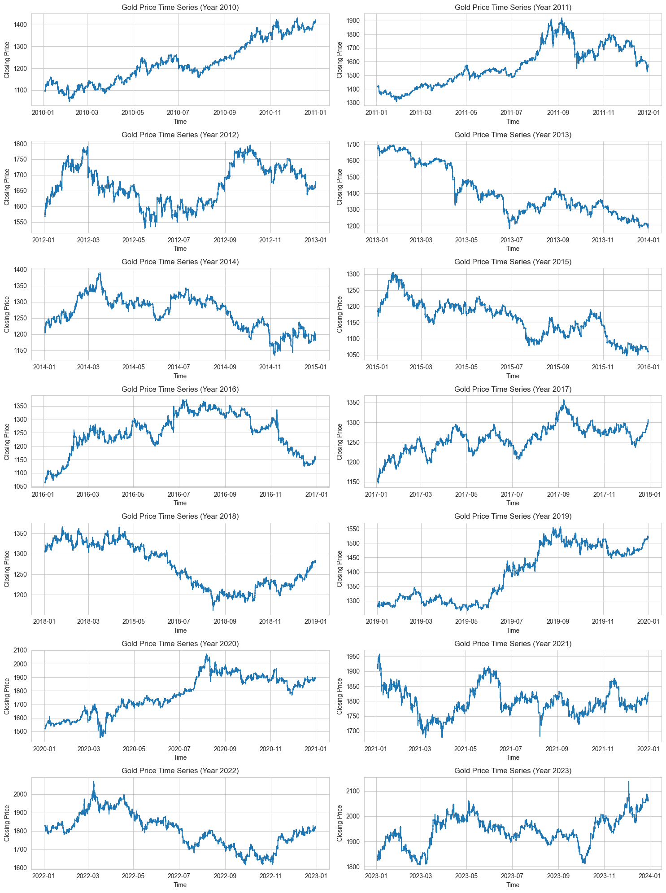
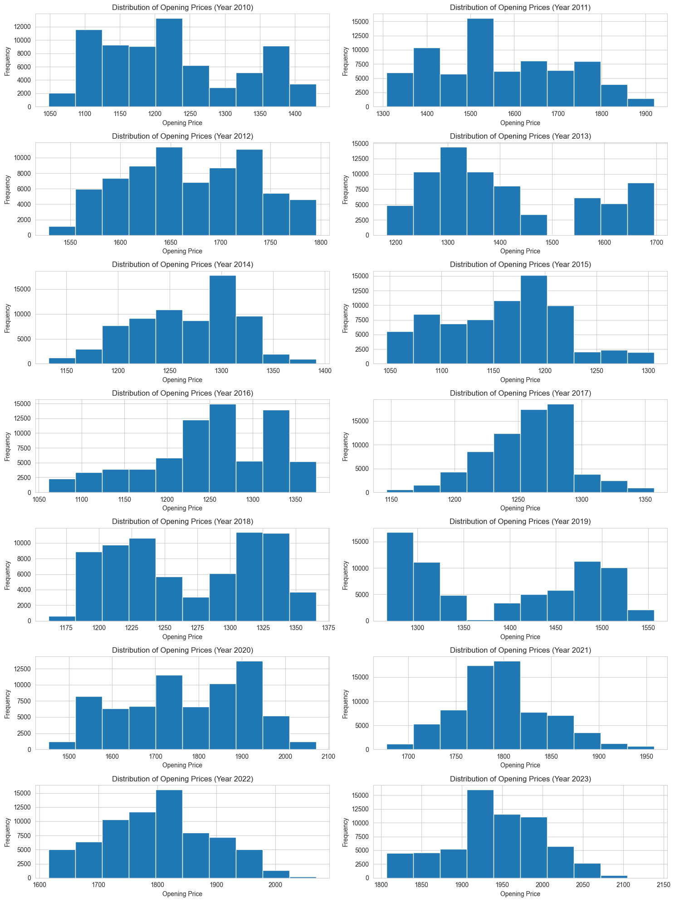

# Gold Price Data Analysis

-----

## Problem Statement

The problem statement addressed by the analysis is to **understand the historical variations** in gold prices and technical indicators such as the Relative Strength Index (RSI14) and Simple Moving Average (SMA14) from **2010 to 2023**. This involves examining the **trends** in opening, closing, low, and high prices, as well as the **frequency distributions** of opening prices, to gain insights into **market dynamics** and **price movements** over the specified period. 

Additionally, the analysis aims to identify any **patterns** or **anomalies** in the RSI14 and SMA14 indicators, which can help **inform investment decisions** and **strategic planning** in the gold market.

-----

## Identify the Data

[Dataset](https://github.com/Tanay-Dwivedi/Gold-Price-Data-Analysis/blob/master/gold.csv)

Identifying the data involves determining the **relevant variables** and **sources** necessary for analysis. It requires **collecting** and **organizing** data to address specific research questions or business objectives.

The dataset I've chosen provides a comprehensive **time-series** of gold market data, including **daily open, high, low, and closing prices**. Additionally, it incorporates technical indicators such as **RSI14** (Relative Strength Index) and **SMA14** (Simple Moving Average), offering insights into **market sentiment** and **price trends**.

-----

## Results & Inference

### Variation of opening price of gold from 2010 to 2023:

**Aim**: To visualize how the opening price of gold has varied over the years from 2010 to 2023.

**Observation**: The line plot shows the trend of opening prices over the years, allowing for observation of any significant changes or patterns in the data.

### Variation of closing price of gold from 2010 to 2023:

**Aim**: To visualize how the closing price of gold has varied over the years from 2010 to 2023.

**Observation**: Similar to the opening price variation, this line plot provides insights into the trend of closing prices over the years.

### Variation of low rate of gold from 2010 to 2023:

**Aim**: To visualize how the low rate of gold has varied over the years from 2010 to 2023.

**Observation**: This line plot helps in understanding the trend of low rates of gold over the years, which might be useful for identifying periods of price fluctuations or stability.

### Variation of high rate of gold from 2010 to 2023:

**Aim**: To visualize how the high rate of gold has varied over the years from 2010 to 2023.

**Observation**: Similar to the low rate variation, this line plot provides insights into the trend of high rates of gold over the years.

### "rsi14" variation over the years (2010 - 2023) using subplots:

**Aim**: To analyze the variation of the RSI14 indicator over the years from 2010 to 2023, with each subplot representing one year.

**Observation**: The subplots allow for a detailed examination of how the RSI14 values change throughout each year, potentially revealing seasonal or cyclical patterns.

### "sma14" variation over the years (2010 - 2023) using subplots:

**Aim**: To analyze the variation of the SMA14 indicator over the years from 2010 to 2023, with each subplot representing one year.

**Observation**: Similar to the RSI14 analysis, this visualization helps in understanding the variation of the SMA14 indicator over time.

### Time series plot of closing price over the years (2010 - 2023):

**Aim**: To visualize the time series of closing prices for each year from 2010 to 2023, with each subplot representing one year.

**Observation**: This analysis provides insights into the overall trend and volatility of closing prices over the years, potentially revealing any long-term patterns or anomalies.

### Frequency variation of Opening price over the years (2010 - 2023):

**Aim**: To visualize the frequency distribution of opening prices for each year from 2010 to 2023, with each subplot representing one year.

**Observation**: This analysis helps in understanding the distribution of opening prices for each year, which might indicate changes in market sentiment or trading activity over time.

-----

## Conclusion

The analysis reveals several key findings regarding **gold price variations** and **technical indicators** from **2010 to 2023**. Notably, there are discernible **trends** in the opening, closing, low, and high prices over the period, suggesting **market volatility** and potential **investment opportunities**.

Additionally, the examination of **RSI14** and **SMA14** indicators indicates fluctuating **market sentiment** and **trading patterns**. The **frequency distributions** of opening prices further highlight **market dynamics** and **price distribution** trends.

Overall, the analysis provides valuable insights for **market participants** and **investors** seeking to understand the **historical performance** of gold and make **informed decisions** for future **investment strategies**.

-----

## Recommendations

1. **Diversify**: Spread investments across different assets to reduce risk.
2. **Use Technical Analysis**: Monitor RSI14 and SMA14 for trading signals.
3. **Stay Informed**: Keep track of market sentiment and economic factors.
4. **Think Long-Term**: Consider gold as a hedge against inflation for the long haul.
5. **Manage Risk**: Set stop-loss orders and position sizing to protect investments.

-----